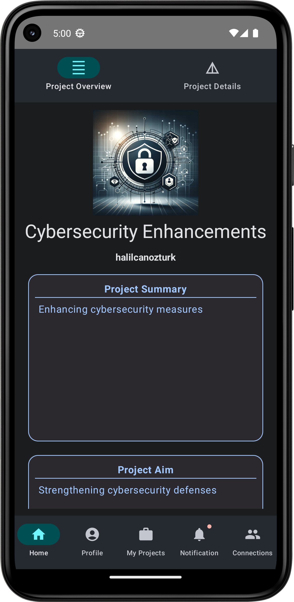
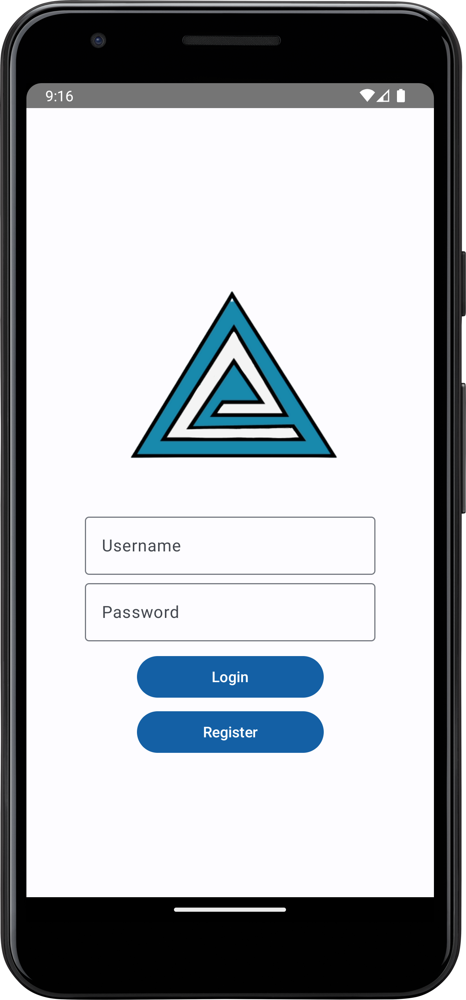
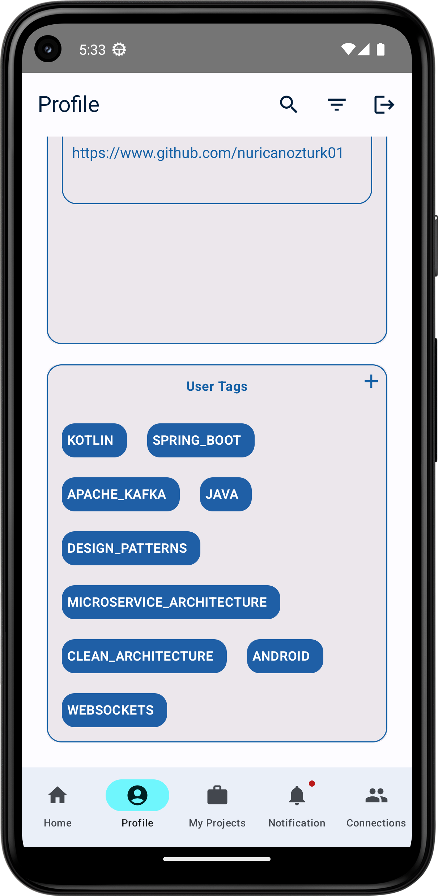

# Call-Of-Project-Android

The Call-of-Project Android app is the mobile counterpart of the Call-of-Project project. This mobile application incorporates some of the backend and frontend features. It employs the MVVM (Model-View-ViewModel) pattern.

## Project Details

For more information about the project, visit our repositories:

- **Backend:** [Call-of-Project-Backend](https://github.com/CallOfProject/CallOfProject-Backend)
- **Interview:** [Call-of-Project-Interview](https://github.com/CallOfProject/Call-Of-Project-Interview)
- **Admin Panel:** [Call-of-Project-Admin-Panel](https://github.com/CallOfProject/CallOfProject-AdminPanel)
- **Frontend:** Not completed yet

This application includes the following features:

- **Sign Up**: Users can create an account to access the app's features.
- **Login**: Secure login for returning users.
- **Main Page**: A project discovery page to find new projects.
- **Project Overview**: Users can view a project's scope before joining.
- **Project Details**: Detailed information is available for joined projects.
- **Project Participation Requests**: Users can send requests to join projects.
- **Notifications**: Users receive notifications based on their actions.
- **Profile Management**: Users can view and edit their profiles, including adding profile pictures, uploading CVs, and modifying other fields.
- **My Projects**: Users can view the projects they created.
- **Incoming Notifications**: Users can view and respond to notifications (approve or reject as needed).
- **Search**: Users can search for any keyword in the app, yielding results for people and projects.
- **User Profiles**: Users can view others' profiles and send follow requests.
- **Project Filters**: Users can filter projects according to their preferences and view them.

## Technology Stack

The application uses the following dependencies:

- **Kotlin**: The primary programming language.
- **Jetpack Compose**: For building modern and responsive UIs.
- **Retrofit**: For network communication.
- **Hilt**: For dependency injection.
- **gson**: For JSON parsing.
- **desugar**: For Java language features.
- **Call-of-Project Services**: Custom backend services.
- **coil**: Library for handling images.
- **RxJava**: For reactive programming.
- **STOMP Protocol**: For real-time communication.

## Images
### Dark Theme

### Light Theme

## Sample Video
https://github.com/CallOfProject/Call-Of-Project-Android/assets/147416047/76afb073-d795-498f-9028-1d57247e743f

## License

This project is licensed under the [MIT License](LICENSE).
